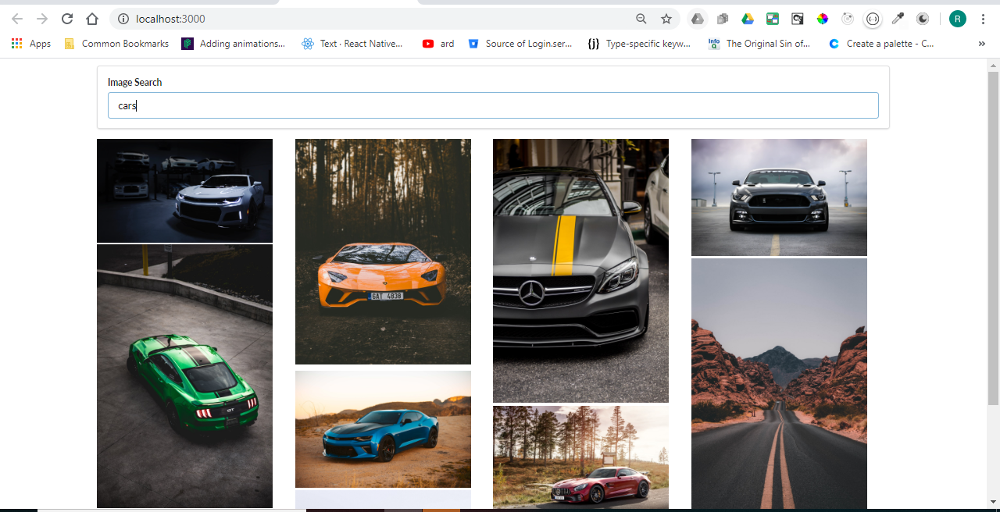

# Picture Search Application

## Description

Created a new react project that has a search bar on the top and based on the searh term, the unsplash API is hit and we get the list of images. Also, creation of a grid dynamically based on the height of the image is also done.

## Steps to run
- Clone the repository.
- There is an API key for the unsplash API that you need to add in the api folder.
- `npm start` to run the application.
  
## React concepts
- Created different components for ImageCard, ImageList and SearchBar.
- Ability to handle form inputs.
- Ability to render lists in React.
- Ability to use ref to access DOM elements.
- Created a clean and functional code.

## Main Screen

